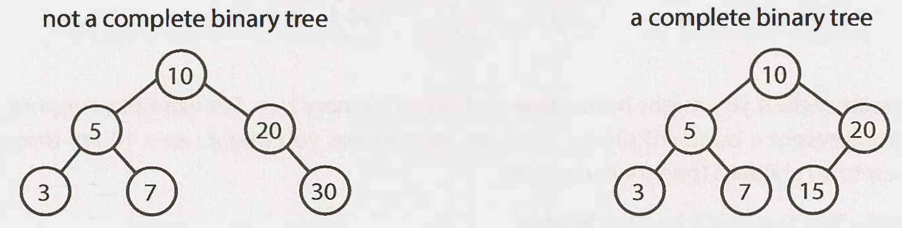
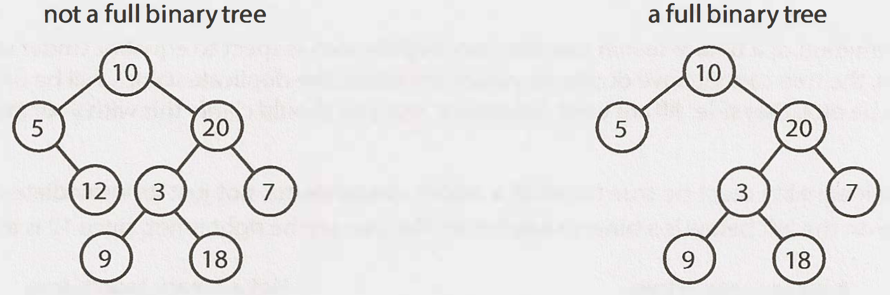
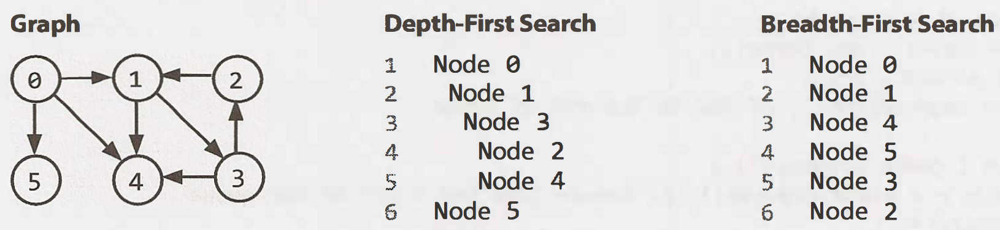

### Chapter 4 Trees and Graphs

#### Tree

* **Types of Tree**
    * Trees vs. Binary Trees
    * Binary Tree vs. Binary Search Tree
        * _BST: all left descendents <= n < all right descendents_
    * Balanced vs. Unbalanced
        * _Red-black trees (Balanced)_
        * _AVL trees (Balanced)_
    * Complete Binary Trees
        * _Every level of the tree is fully filled, except for perhaps the last level_
        
    * Full Binary Trees
        * _every node has either zero or two children_
        
    * Perfect Binary Trees
        * _Both full and complete_

* **Binary Tree Traversal**
    * In-Order Traversal ★★★
        * _left branch -> current node -> right branch._
        ```java
          void inOderTravsersal(TreeNode node) {
            if (node != null) {
              inOderTravsersal(node.left);
              visit(node);
              inOderTravsersal(node.right);
            }
          }
        ```
    * Pre-Order Traversal
        * _current node -> child nodes_
        ```java
          void preOderTravsersal(TreeNode node) {
            if (node != null) {
              visit(node);
              inOderTravsersal(node.left);
              inOderTravsersal(node.right);
            }
          }
        ```
    * Post-Order Traversal
        * _child nodes -> current node_
        ```java
          void postOderTravsersal(TreeNode node) {
            if (node != null) {
              inOderTravsersal(node.left);
              inOderTravsersal(node.right);
              visit(node);
            }
          }
        ```
* **Binary Heaps**
    * Min-Heaps
        * _A **complete binary tree** where each node is smaller than its children. The root is the minimum element in the tree._
        * Two key operations:
            1. `Insert`
            2. `Extract Minimum Element`
    * Max-Heaps
    

* Tries (Prefix Trees)

#### Graph

* Graph Representation
    * Adjacency List
    * Adjacency Matrices
    
* Graph Search
    
    * Depth-First Search (DFS)
      
      ```text
      void DFS(Node root) {
          if (root == null) return;
          visit(root);
          root.visited = true;
          for each (Node n in node.adjacent) {
              if (n.visited == false) {
                  DFS(n);
              }
          }
      }
      ```

    * Breadth-First Search (BFS)
      
      ```text
      void BFS(Node root) {
          Queue queue = new Queue();
          root.marked = true;
          queue.enqueue(root); // Add to the end of queue
          
          while (!queue.isEmpty()) {
              Node r= queue.dequeue(); // Remove from the front of the queue
              visit(r);
              foreach (Node n in r.adjacent) {
                  if (n.marked == false) {
                      n.marked = true;
                      queue.enqueue(n);
                  }
              }
          }
      }  
      ```
    * Bidirectional Search
        * Find the shortest path between a source and destination node.
        * Running two simultaneous **breadth-first searches (BFS)**, one from each node. 
        * When their searches collide, we have found a path.

---

| Questions                 | LeetCode                               |
| ------------------------- | -------------------------------------- |
| 1. Route Between Nodes    |  | 
| 2. Minimal Tree           |  |
| 3. List of Depths         |  |
| 4. Check Balanced         |  |
| 5. Validate BST           |  |
| 6. Successor              |  |
| 7. Build Order            |  |
| 8. First Common Ancestor  |  |
| 9. BST Sequences          |  |
| 10. Check Subtree         |  |
| 11. Random Node           |  |
| 12. Paths with Sum        |  |